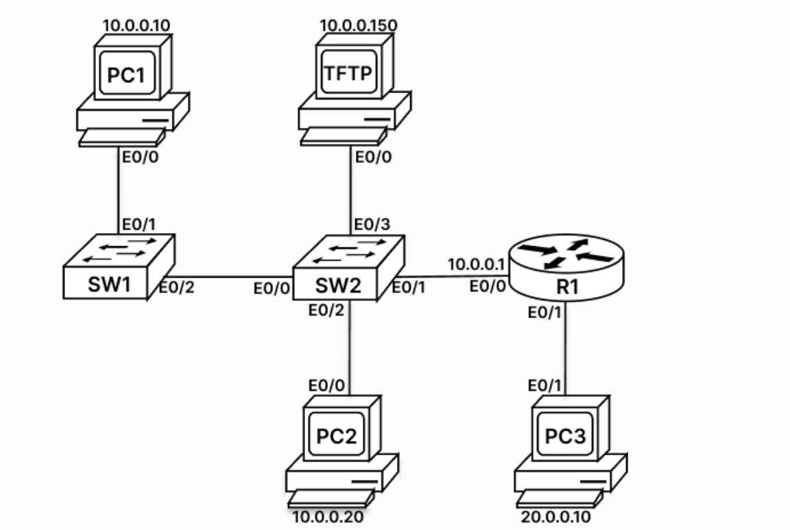

# TFTP Backup and Restore Lab (Cisco IOS)

## Aim
Part 1: Back up the startup-config of router R1 to a TFTP server (`10.0.0.150`).
Part 2: Erase the configuration, reload the router, and restore the config from the TFTP server.

## Topology



> Add your topology screenshot in the same folder with the name `topology.png`.

## IP Addressing Table

| Device | Interface | IP Address | Subnet Mask | Default Gateway |
|---|---|---|---|---|
| R1 | E0/0 | 10.0.0.1 | 255.255.255.0 | N/A |
| R1 | E0/1 | 20.0.0.1 | 255.255.255.0 | N/A |
| PC1 | NIC | 10.0.0.10 | 255.255.255.0 | 10.0.0.1 |
| PC2 | NIC | 10.0.0.20 | 255.255.255.0 | 10.0.0.1 |
| TFTP Server | NIC | 10.0.0.150 | 255.255.255.0 | 10.0.0.1 |
| PC3 | NIC | 20.0.0.10 | 255.255.255.0 | 20.0.0.1 |

## Requirements
- Cisco Packet Tracer / GNS3 / real lab devices
- A running TFTP server on `10.0.0.150` with a root directory set
- Connectivity between R1 and the TFTP server

---

# Part 1: Backup (Router to TFTP Server)

## Step 1: Basic Router Configuration

```
Router> enable
Router# configure terminal
Router(config)# hostname R1
R1(config)# interface ethernet 0/0
R1(config-if)# ip address 10.0.0.1 255.255.255.0
R1(config-if)# no shutdown
R1(config-if)# exit
R1(config)# interface ethernet 0/1
R1(config-if)# ip address 20.0.0.1 255.255.255.0
R1(config-if)# no shutdown
R1(config-if)# end
```

| Command | Explanation |
|---|---|
| `enable` | Moves from user mode to privileged mode (`#`) |
| `configure terminal` | Enters global configuration mode |
| `hostname R1` | Sets the router name to R1 |
| `interface ethernet 0/0` | Selects the interface connected to SW2 |
| `ip address 10.0.0.1 255.255.255.0` | Assigns the LAN gateway IP used by PC1, PC2 and the TFTP server |
| `no shutdown` | Turns the interface on (router interfaces are down by default) |
| `exit` | Returns to global configuration mode |
| `interface ethernet 0/1` | Selects the interface connected to PC3 |
| `ip address 20.0.0.1 255.255.255.0` | Assigns the gateway IP of the 20.0.0.0 network |
| `end` | Returns directly to privileged mode |

## Step 2: Verify Interfaces

```
R1# show ip interface brief
Interface          IP-Address       OK?       Method       Status                     Protocol
Ethernet0/0        10.0.0.1         YES       manual       up                         up
Ethernet0/1        20.0.0.1         YES       manual       up                         up
Ethernet0/2        unassigned       YES       unset        administratively down      down
Ethernet0/3        unassigned       YES       unset        administratively down      down
Serial1/0          unassigned       YES       unset        administratively down      down
Serial1/1          unassigned       YES       unset        administratively down      down
Serial1/2          unassigned       YES       unset        administratively down      down
Serial1/3          unassigned       YES       unset        administratively down      down
```

E0/0 and E0/1 should show **Status: up** and **Protocol: up**, with Method **manual** (the IP was entered by hand).

## Step 3: Test Connectivity to the TFTP Server

```
R1# ping 10.0.0.150
Type escape sequence to abort.
Sending 5, 100-byte ICMP Echos to 10.0.0.150, timeout is 2 seconds:
!!!!!
Success rate is 100 percent (5/5)
```

- `!!!!!` means the server is reachable.
- `.....` means the ping failed. Check the server IP, gateway and switch port status.

TFTP will not work unless this ping succeeds.

## Step 4: Save the Configuration

```
R1# write
Building configuration...
[OK]
```

`write` (same as `write memory` or `copy running-config startup-config`) saves the running-config from RAM to NVRAM as the startup-config. This must be done before the backup, otherwise the startup-config will be empty.

## Step 5: Backup to the TFTP Server

```
R1# copy startup-config tftp:
Address or name of remote host []? 10.0.0.150
Destination filename [r1-confg]? R1-startup.cfg
!!
[OK - 1234 bytes]
```

| Prompt | Input |
|---|---|
| Address or name of remote host | `10.0.0.150` (TFTP server IP) |
| Destination filename | `R1-startup.cfg` (file name on the server) |

`!` marks and `[OK - xxxx bytes]` confirm the transfer. The byte count depends on your configuration. Also check that the file appears in the TFTP server folder.

---

# Part 2: Erase, Reload and Restore (TFTP Server to Router)

## Step 1: Erase the Startup-Config

```
R1# write erase
Erasing the nvram filesystem will remove all configuration files! Continue? [confirm]
[OK]
Erase of nvram: complete
```

`write erase` deletes the startup-config from NVRAM (same as `erase startup-config`). Without this step the router would reload with the same config and there would be nothing to restore.

## Step 2: Reload the Router

```
R1# reload
System configuration has been modified. Save? [yes/no]: no
Proceed with reload? [confirm]

System Bootstrap, Version 15.2(2)T, RELEASE SOFTWARE (fc1)
...
Press RETURN to get started!

Router> enable
Router#
```

| Prompt | Input |
|---|---|
| `Save? [yes/no]` | **no** (yes would save the running-config again and defeat the erase) |
| `Proceed with reload? [confirm]` | Press Enter |

After the reload the prompt is `Router#` instead of `R1#`, which proves the configuration was erased.

## Step 3: Give the Router Temporary Connectivity

The erased router has no IP address, so E0/0 must be configured before it can reach the TFTP server.

```
Router# configure terminal
Router(config)# interface ethernet 0/0
Router(config-if)# ip address 10.0.0.1 255.255.255.0
Router(config-if)# no shutdown
Router(config-if)# end

Router# ping 10.0.0.150
!!!!!
Success rate is 100 percent (5/5)
```

## Step 4: Restore the Config from the TFTP Server

```
Router# copy tftp: running-config
Address or name of remote host []? 10.0.0.150
Source filename []? R1-startup.cfg
Destination filename [running-config]?
Accessing tftp://10.0.0.150/R1-startup.cfg...
Loading R1-startup.cfg from 10.0.0.150 (via Ethernet0/0): !
[OK - 1234 bytes]

R1#
```

The file is merged into the running-config. The prompt changes from `Router#` to `R1#` because the hostname is loaded from the file.

## Step 5: Verify the Restored Configuration

```
R1# show running-config
Building configuration...

Current configuration : 1234 bytes
!
version 15.2
hostname R1
!
interface Ethernet0/0
 ip address 10.0.0.1 255.255.255.0
 no shutdown
!
interface Ethernet0/1
 ip address 20.0.0.1 255.255.255.0
 no shutdown
!
end

R1# show ip interface brief
Interface          IP-Address       OK?       Method       Status                     Protocol
Ethernet0/0        10.0.0.1         YES       TFTP         up                         up
Ethernet0/1        20.0.0.1         YES       TFTP         up                         up
Ethernet0/2        unassigned       YES       unset        administratively down      down
Ethernet0/3        unassigned       YES       unset        administratively down      down
Serial1/0          unassigned       YES       unset        administratively down      down
Serial1/1          unassigned       YES       unset        administratively down      down
Serial1/2          unassigned       YES       unset        administratively down      down
Serial1/3          unassigned       YES       unset        administratively down      down
```

Method shows **TFTP** because the configuration was loaded from the TFTP server.

## Step 6: Save the Restored Configuration

```
R1# write
Building configuration...
[OK]
```

`copy tftp: running-config` only loads the config into RAM. Without `write`, the config is lost on the next reload.

---

## Common Errors

| Problem | Cause | Fix |
|---|---|---|
| Ping to TFTP fails | Wrong IP, gateway, or switch port down | Recheck addressing and SW2 ports E0/1 and E0/3 |
| `%Error opening tftp` / timeout | TFTP service not running or wrong server IP | Start the TFTP server and verify the IP |
| Empty backup file | startup-config was never saved | Run `write` before the backup |
| Hostname stays `R1` after reload | startup-config was not erased | Run `write erase` before `reload` |
| Ping fails after reload | Router has no IP after erase | Configure E0/0 and `no shutdown` before restoring |
| Config lost after next reload | Restored config not saved | Run `write` after the restore |

## Key Points
- TFTP uses **UDP port 69**.
- TFTP has **no authentication or encryption**, so it is suitable only for labs and trusted networks.
- `write erase` deletes the config, `reload` restarts the router, `copy tftp: running-config` restores it, `write` saves it.
- Hostname changing from `Router` to `R1` after the restore confirms it worked.

## Tools Used
Cisco IOS CLI, TFTP server, Cisco Packet Tracer / GNS3

## Author
**Ali Raza Choudhary**
CCNA trainee | BSc Computer Science, University of Mumbai
